# ScholarStream — Real-time OpenAlex to Snowflake via AWS Firehose
_A compact, production-minded pipeline that streams OpenAlex works into Snowflake (RAW to CURATED) with a minimal Streamlit dashboard and Terraform-provisioned Firehose._

## Description

**Problem.** Spinning up a realistic, governed, and observable “events to warehouse” pipeline is often slow and ad-hoc.

**Solution.** This repo provides a small but complete path:
- **Python producer** fetches OpenAlex **works** and batches NDJSON to **Amazon Kinesis Data Firehose**.
- Firehose writes into **Snowflake RAW** (VARIANT payload + metadata); **CURATED** views project analytics-friendly columns and compute end-to-end latency.
- A **Streamlit** app shows live latency metrics and recent rows.
- **Terraform** stands up Firehose + IAM + CloudWatch + S3 backup; **SQL** sets up DB/roles/views/masking.


## Highlights
- ⚡ **Near-real-time** ingestion with simple batching
- 🧭 **Governance-ready**: dedicated roles (ingest/transform/analyst) + dynamic masking of `email`
- 🔎 **Observability**: curated latency view (`VW_LATENCY`) + recent events table (`VW_WORKS`)
- 🧱 **Infra as Code**: Terraform for Firehose, IAM, logs, S3 error backup
- 🖥️ **Demo UI**: Streamlit dashboard (latency KPIs + recent works)

## Architecture

```mermaid
%%{init: {
  "theme": "base",
  "themeVariables": {
    "primaryColor": "#EEF2FF",
    "secondaryColor": "#E0F2FE",
    "tertiaryColor": "#F8FAFC",
    "primaryTextColor": "#0F172A",
    "lineColor": "#94A3B8",
    "fontFamily": "ui-sans-serif,system-ui,-apple-system,Segoe UI,Roboto,Ubuntu,Cantarell,Noto Sans",
    "clusterBkg": "#F8FAFC",
    "clusterBorder": "#CBD5E1"
  },
  "flowchart": { "curve": "linear" }
}}%%
flowchart LR

  subgraph S1["Sources"]
    OA["OpenAlex API"]
  end

  subgraph S2["Ingestion"]
    PR["Python Producer"]
    FH["Amazon Kinesis Data Firehose"]
    PR --> FH
  end

  subgraph S3["Storage (Snowflake)"]
    RAW["RAW
    OPENALEX_EVENTS (VARIANT)"]
    CUR["CURATED
    VW_WORKS & VW_LATENCY"]
    RAW --> CUR
  end

  subgraph S4["Application"]
    APP["Streamlit App"]
  end

  OA --> PR
  FH --> RAW
  CUR --> APP

  classDef src   fill:#E0F2FE,stroke:#0284C7,stroke-width:1px,rx:12,ry:12;
  classDef proc  fill:#DBEAFE,stroke:#2563EB,stroke-width:1px,rx:12,ry:12;
  classDef pipe  fill:#EDE9FE,stroke:#7C3AED,stroke-width:1px,rx:12,ry:12;
  classDef db    fill:#F1F5F9,stroke:#0EA5E9,stroke-width:1px,rx:12,ry:12;
  classDef app   fill:#DCFCE7,stroke:#10B981,stroke-width:1px,rx:12,ry:12;

  class OA src;
  class PR proc;
  class FH pipe;
  class RAW,CUR db;
  class APP app;

  linkStyle default stroke:#94A3B8,stroke-width:2px;
```



**Trade-offs (brief):**

* Firehose to Snowflake (direct) favors **low setup** and **low latency**; S3 to Snowpipe would add file-level lineage at the cost of delay/complexity.
* Views keep the landing table **schema-agnostic** while giving analysts stable columns.

## Tech Stack

* **Python 3.12+** · **Streamlit** · **Typer / Rich**
* **AWS**: Kinesis Data Firehose, CloudWatch, S3
* **Snowflake**: RAW (VARIANT), CURATED views, RBAC, dynamic masking
* **Terraform** (AWS provider) · **Makefile** helpers

## Getting Started

### 1) Prerequisites

* Python **3.12+**
* **Snowflake** account (ability to run SQL and create roles/warehouses)
* **AWS** account with permissions to create Firehose
* **Terraform ≥ 1.6**, **AWS CLI v2**, **jq**, **git**

### 2) Clone & set up the environment

```bash
git clone https://github.com/<your-user>/scholarstream.git
cd scholarstream

python -m venv .venv
source .venv/bin/activate   # Windows: .venv\Scripts\activate
python -m pip install -U pip

# Install runtime dependencies (derived from code & pyproject)
pip install pandas python-dotenv rich ruff snowflake streamlit typer boto3 requests pydantic
```

> Tip: copy the provided example env and fill in credentials.

```bash
cp .env.example .env
# edit .env with your values
```

Minimum useful keys (see full example below):

```env
AWS_REGION=us-east-1
SECRET_NAME=scholarstream/snowflake/firehose
FIREHOSE_NAME=scholarstream-openalex
OPENALEX_EMAIL=your-email+scholarstream@example.com

SNOWFLAKE_ACCOUNT=xxxxx-xxxxxxx
SNOWFLAKE_USER=your_user
SNOWFLAKE_PASSWORD=your_password
SNOWFLAKE_DATABASE=SCHOLARSTREAM
SNOWFLAKE_SCHEMA=CURATED           # app reads CURATED
SNOWFLAKE_SCHEMA_RAW=RAW           # infra/SQL target
SNOWFLAKE_TABLE=OPENALEX_EVENTS
SNOWFLAKE_WAREHOUSE=WH_INGESTION_XS
```

### 3) Initialize Snowflake (DB, roles, RAW/CURATED, masking)

```bash
make sql-apply ARGS="--verbose"
```

This runs the numbered scripts in `sql/` to create warehouses, schemas, roles/policies, the `RAW.OPENALEX_EVENTS` table, and the `CURATED` views + masking policy.

### 4) Bootstrap identity & Firehose (Terraform)

Create/link Snowflake keypair and store the JSON secret in **AWS Secrets Manager**:

```bash
make bootstrap-identity-secure
```

Plan/apply the Firehose stack:

```bash
make tf-init
make tf-plan
make tf-apply
```

This creates: Firehose (destination=snowflake), IAM role/policies, CloudWatch logs, and an S3 backup prefix for failed records.

### 5) Run the components

**Producer (OpenAlex to Firehose):**

```bash
# Dry-run (no sends)
python -m ingestion.producer --dry-run --batch-size 3 --max-pages 1

# Live send (uses .env defaults unless overridden)
python -m ingestion.producer --batch-size 50 --batch-sleep 1
```

**Streamlit app (metrics + recent rows):**

```bash
streamlit run app/home.py
```

Open the sidebar, confirm connection details (role/warehouse/database/schema), and you should see latency KPIs once data flows.

## Usage

**Handy queries (Snowflake):**

```sql
-- Latency over the last 5 minutes
SELECT * FROM SCHOLARSTREAM.CURATED.VW_LATENCY;

-- Most recent works
SELECT WORK_ID, TITLE, PRIMARY_AUTHOR, PUBLICATION_YEAR, EMAIL, EVENT_TS, LANDED_TS, LATENCY_SECONDS
FROM SCHOLARSTREAM.CURATED.VW_WORKS
ORDER BY LANDED_TS DESC
LIMIT 20;
```

**Masking demo:** Use an analyst role to see masked `email`, and a higher-privilege role (`ACCOUNTADMIN`, `R_TRANSFORM`, `R_INGEST`) to see the clear value.

**Make targets (quick ref):**

```bash
make env-show                 # print important .env values
make env-check                # verify tools + core env for infra
make sql-apply                # run SQL 01..05
make bootstrap-identity-secure
make tf-init tf-plan tf-apply # provision Firehose stack
make send-test                # send one NDJSON record
make run-producer             # start producer with defaults
```

## Configuration (.env example)

```env
# Core AWS/Firehose (Ingestion)
AWS_REGION=us-east-1
FIREHOSE_NAME=scholarstream-openalex
SECRET_NAME=scholarstream/snowflake/firehose

# OpenAlex
OPENALEX_BASE_URL=https://api.openalex.org
OPENALEX_EMAIL=your-email+scholarstream@example.com

# Producer configs
PRODUCER_BATCH_SIZE=50
PRODUCER_SLEEP_SECONDS=2
SOURCE_TAG=openalex

# Snowflake (Streamlit app + SQL/apply)
SNOWFLAKE_ACCOUNT=xxxxxx-xxxxxxxx
SNOWFLAKE_USER=your_user
SNOWFLAKE_PASSWORD=your_password
SNOWFLAKE_ROLE=R_ANALYST
SNOWFLAKE_WAREHOUSE=WH_INGESTION_XS
SNOWFLAKE_DATABASE=SCHOLARSTREAM
SNOWFLAKE_SCHEMA=CURATED
SNOWFLAKE_TABLE=OPENALEX_EVENTS
SNOWFLAKE_SCHEMA_RAW=RAW
SNOWFLAKE_SCHEMA_CURATED=CURATED

# (Infra/Terraform) Public account URL
SNOWFLAKE_ACCOUNT_URL=xy12345.sa-east-1.snowflakecomputing.com

# Local keys (identity bootstrap)
KEY_DIR=.keys

# Firehose service user
FIREHOSE_SNOWFLAKE_USER=FIREHOSE_INGESTOR
```

## File Structure

```text
.
├── app
│   └── home.py
├── infra
│   ├── main.tf
│   ├── outputs.tf
│   ├── README.md
│   └── variables.tf
├── ingestion
│   ├── config.py
│   ├── firehose_client.py
│   ├── __init__.py
│   ├── openalex_client.py
│   ├── producer.py
│   ├── schema.py
│   └── utils.py
├── Makefile
├── pyproject.toml
├── README.md
├── .gitignore
├── .python-version
├── .env.example
├── .env
├── sql
│   ├── 00_service_user.sql
│   ├── 01_init_snowflake.sql
│   ├── 02_rbac_policies.sql
│   ├── 03_tables_raw.sql
│   ├── 04_views_curated.sql
│   ├── 05_masking_policy.sql
│   ├── 06_link_public_key.sql
│   ├── 06_link_public_key.sql.tmpl
│   ├── apply.py
│   └── bootstrap_firehose_identity_secure.sh
└── uv.lock
```

## Troubleshooting

* **Missing deps in app:** `snowflake-connector-python` is required by `app/home.py`. Ensure the `snowflake` package is installed.
* **Producer errors:** Check AWS credentials/region and that `FIREHOSE_NAME` exists.
* **Firehose failures:** Inspect CloudWatch Logs and the S3 backup prefix for error samples.
* **Masking not applied:** Confirm the masking policy script ran and you’re querying as an analyst role.