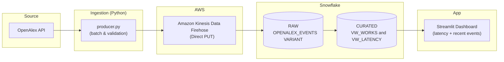

# ScholarStream — Real-time ingestion (AWS Firehose → Snowflake) with governance


> **One-liner:** ScholarStream is a portfolio-grade, real-time ingestion pipeline that streams JSON events from AWS Firehose into Snowflake (RAW → CURATED), with simple observability, RBAC, and a dynamic masking policy, plus a minimal Streamlit demo.

## About the project

**Motivation:** Real-time pipelines are often ad-hoc and hard to demo. This repo showcases a compact, secure, and observable path from cloud sources to Snowflake that mirrors what many roles value (standardization, RBAC, masking, and “good DevX”).  
**Solution:** A Python producer batches OpenAlex events → Firehose (direct PUT) → Snowflake `RAW` (VARIANT). Views project curated fields and compute E2E latency. A Streamlit app shows latency and recent records. RBAC separates ingestion/transform/analytics and a masking policy hides a sensitive (synthetic) column in non-privileged roles.  

## Architecture



**Key trade-offs:**

- Firehose→Snowflake keeps setup minimal and latency low;
- S3→Snowpipe brings file-level observability at slightly higher latency.
- Latency SLO is \~20–30s avg in dev, p95 <60s is acceptable for demo.

## Tech stack

* **Data plane:** Python 3.12, AWS Kinesis Data Firehose (Direct PUT), Snowflake (VARIANT + views)
* **Governance:** Snowflake RBAC (roles: `R_INGEST`, `R_TRANSFORM`, `R_ANALYST`), dynamic masking policy
* **Observability:** `VW_LATENCY` (avg/min/max over last 5 min) + recent sample
* **App:** Streamlit
* **DevX:** Makefile (lint/clean/sql-apply), `apply.py` (executes SQL in order), Ruff
* **IaC and CI/CD:** Terraform for Firehose/permissions, GitHub Actions

## Getting started (5 steps)

### 1) Prerequisites

* Python **3.12+**
* Snowflake account (ability to run SQL and create roles/warehouses)
* AWS account with permissions to create a Firehose delivery stream
* Git + Make

### 2) Clone & env

```bash
git clone https://github.com/<your-user>/scholarstream.git
cd scholarstream
python -m venv .venv && source .venv/bin/activate   # Windows: .venv\Scripts\activate
pip install -r requirements.txt
cp .env.example .env && nano .env
```

### 3) Initialize Snowflake (SQL base + RBAC)

Scripts live in `sql/` and are executed in numeric order:

* `01_init_snowflake.sql` — warehouses, database, schemas
* `02_rbac_policies.sql` — roles + grants
* `03_tables_raw.sql` — `RAW.OPENALEX_EVENTS` (VARIANT + timestamps)
* `04_views_curated.sql` — `VW_WORKS`, `VW_LATENCY`
* `05_masking_policy.sql` — masking policy on `email`

Run:

```bash
make sql-apply ARGS="--verbose"
```

### 4) Configure Firehose

Create a Kinesis Data Firehose delivery stream targeting Snowflake (or S3→Snowpipe as a variant). Use **JSON newline-delimited** records. Set conservative buffering (e.g., 1–2MB / 10–30s) for demo-grade latency.

### 5) Run the components

```bash
# (A) Producer: sends OpenAlex batches to Firehose
python ingestion/producer.py --batch-size 50 --sleep 2

# (B) App: minimal UI for latency + recent events
streamlit run app/Home.py
```

## Usage & demo script (2–3 min)

1. **Send a batch** from the producer; show **count increasing** and **avg latency** in Streamlit.
2. Run **one analytical query** (e.g., top authors/year) on `VW_WORKS`; comment on stability/cost.
3. Switch role to `R_ANALYST` and show that the **email** column is masked.

Useful queries:

```sql
-- As R_ANALYST
SELECT * FROM SCHOLARSTREAM.CURATED.VW_LATENCY;

SELECT title, primary_author, publication_year, email
FROM SCHOLARSTREAM.CURATED.VW_WORKS
ORDER BY LANDED_TS DESC
LIMIT 20;
```

## Acceptance criteria (DoD)

* **Ingestion:** events visible in `SCHOLARSTREAM.RAW.OPENALEX_EVENTS` in <30s after send
* **Transform:** `VW_WORKS` and `VW_LATENCY` working; avg latency <20–30s in dev
* **Security:** roles separated; **1 dynamic masking policy** applied
* **DevX:** `make lint`, `make clean`, `make sql-apply` work w/o errors
* **Docs:** README with **5-step setup** and screenshots/GIFs (add in PR)

## Roadmap (MVP → Next)

- [x] SQL base + RBAC + RAW table
- [ ] Producer + Firehose tuning
- [ ] Streamlit minimal UI
- [ ] Masking policy & RBAC demo
- [ ] Terraform for Firehose/Secrets; simple alert; Kinesis as source